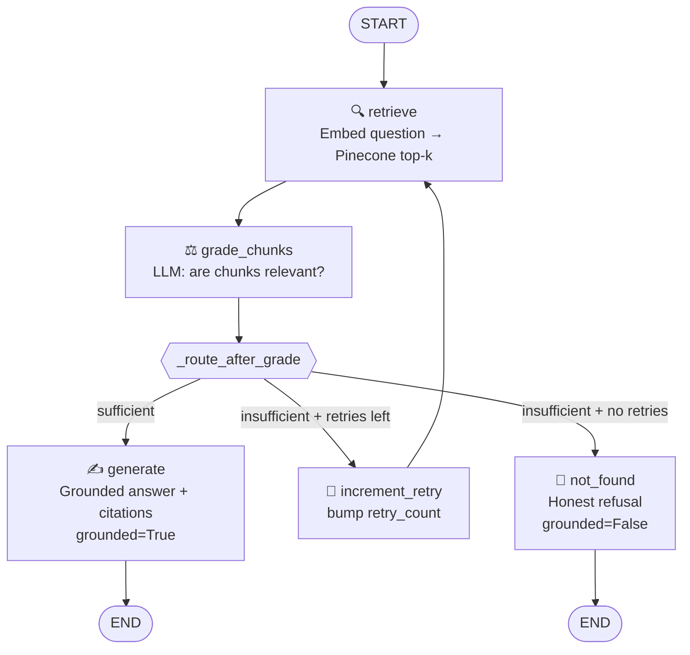

# LangGraph Flow — Legixo Q&A System

## Overview

The Q&A pipeline is implemented as a `StateGraph` using LangGraph.  
Every node reads from and writes to a shared `QAState` TypedDict.  
A conditional edge after `grade_chunks` creates the key branch in the graph.

---

## Node Descriptions

| Node | File | Responsibility |
|------|------|----------------|
| `retrieve` | `app/graph/nodes.py` | Embeds the question (Gemini `text-embedding-004`, RETRIEVAL_QUERY task), queries Pinecone top-k, returns raw `RetrievedChunk` list |
| `grade_chunks` | `app/graph/nodes.py` | Sends question + chunk texts to Gemini Flash; asks it to judge relevance. Returns `grade = "sufficient" \| "insufficient"` and the `graded_chunks` subset |
| `generate` | `app/graph/nodes.py` | Constructs a grounded answer using **only** the `graded_chunks`. Attaches citations `{source_file, chunk_id, snippet, score}`. Sets `grounded=True` |
| `not_found` | `app/graph/nodes.py` | Returns a clear refusal message. Empty citations. Sets `grounded=False`. No fabrication |
| `increment_retry` | `app/graph/graph.py` | Bumps `retry_count` in state before looping back to `retrieve`. This is the loop guard mechanism |

---

## Conditional Routing (`_route_after_grade`)

```
grade == "sufficient"                          → generate
grade == "insufficient" AND retry_count < MAX  → increment_retry → retrieve
grade == "insufficient" AND retry_count >= MAX → not_found
```

`MAX_RETRIES` defaults to `2` (configurable via `.env`).  
This means the system makes **at most 3 retrieval attempts** (initial + 2 retries) before refusing — it cannot spin forever.

---

## Mermaid Diagram



---

## State Schema (`QAState`)

```python
class QAState(TypedDict):
    # Input
    question: str

    # Retrieval
    retrieved_chunks: List[RetrievedChunk]

    # Grading
    grade: str                    # "sufficient" | "insufficient"
    graded_chunks: List[RetrievedChunk]

    # Generation
    answer: str
    citations: List[Dict]         # {source_file, chunk_id, snippet, score}
    grounded: bool

    # Loop control
    retry_count: int

    # Observability
    trace: List[str]              # e.g. ["retrieve", "grade_chunks", "generate"]
```

---

## Why This Design

- **Section-level chunks** (split by `##` headings) keep related facts together, so grading is meaningful.
- **Asymmetric embeddings** (`RETRIEVAL_DOCUMENT` at ingest, `RETRIEVAL_QUERY` at query time) improve retrieval accuracy with Gemini's `text-embedding-004`.
- **LLM grading** catches cases where vector similarity returns topically-adjacent but factually irrelevant chunks (e.g., O2/O3 trap questions).
- **Loop cap** (`MAX_RETRIES=2`) satisfies the assignment requirement that the graph "cannot spin forever".
